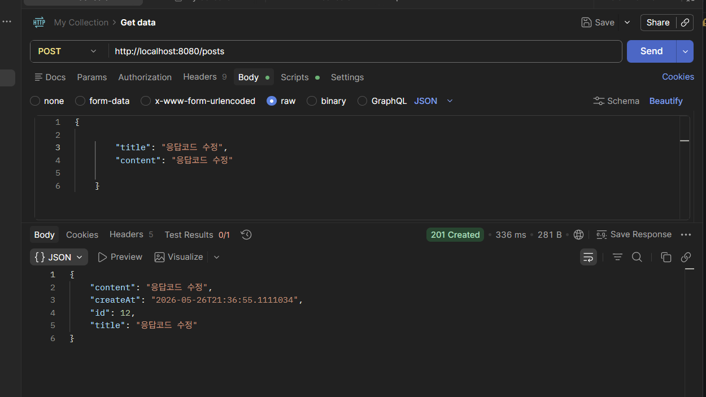
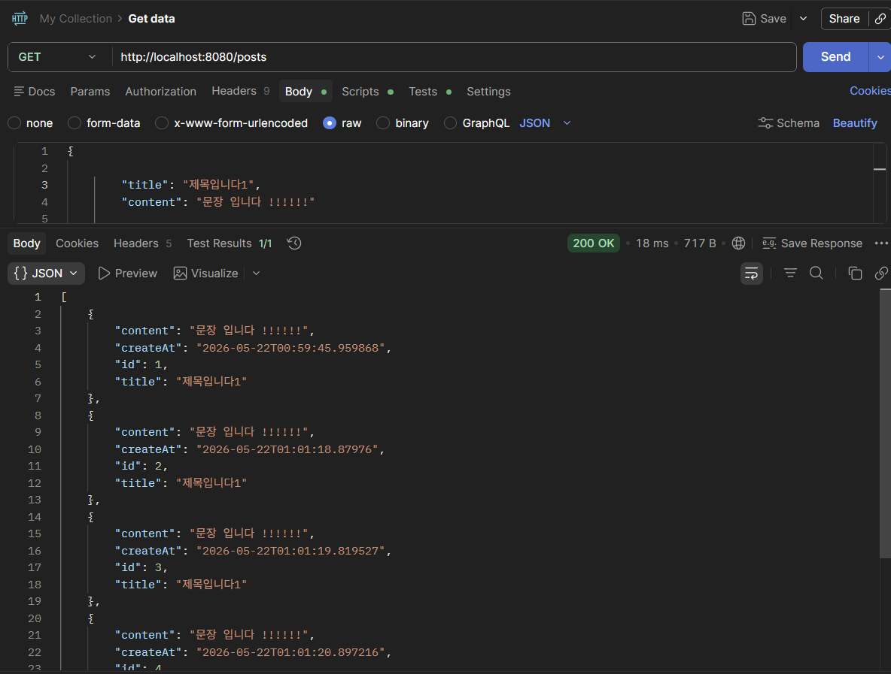
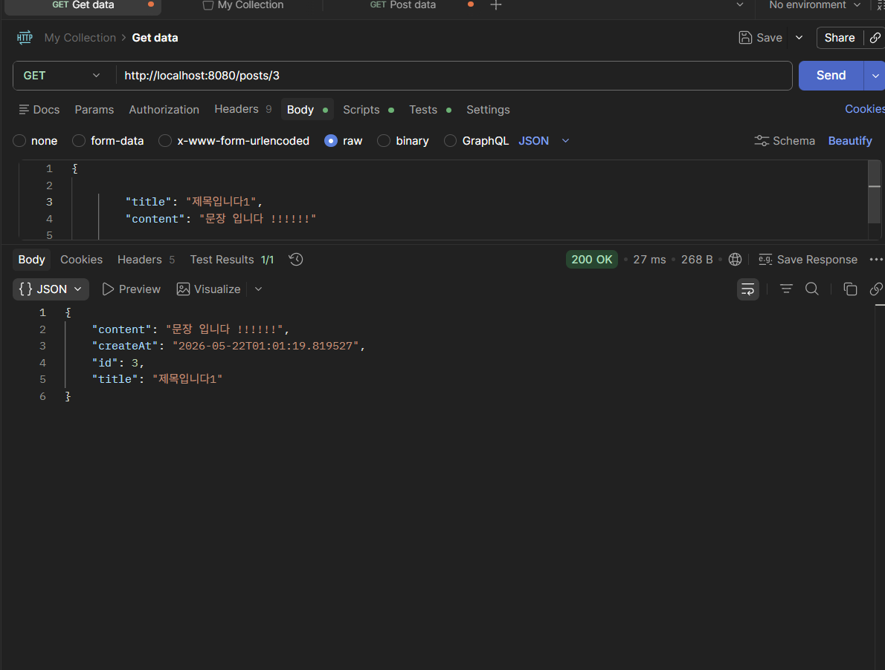
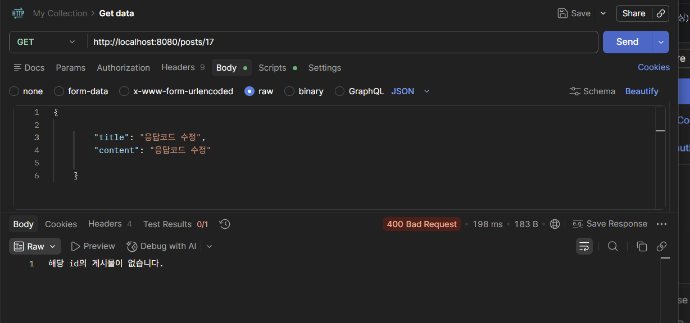
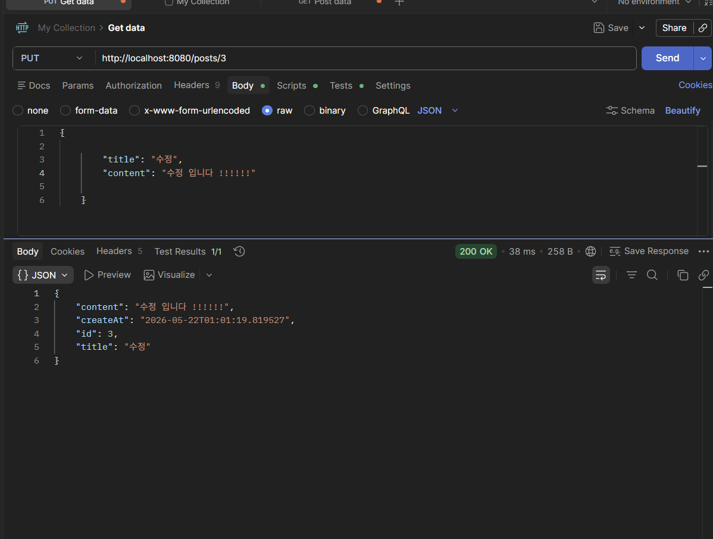
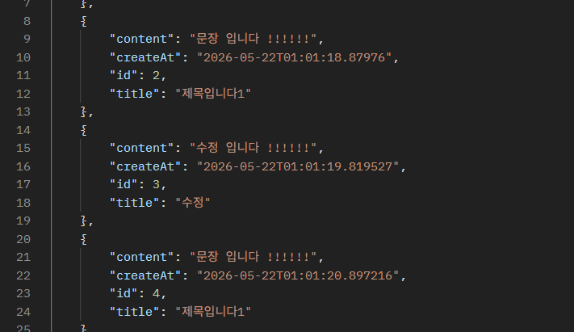
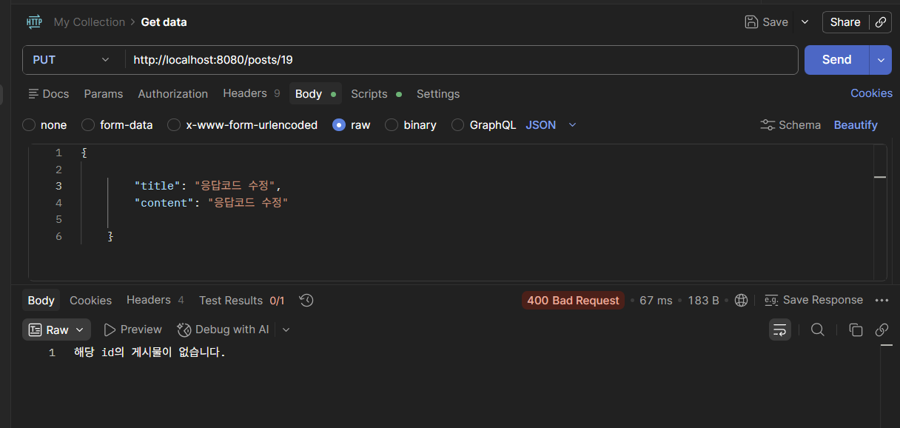
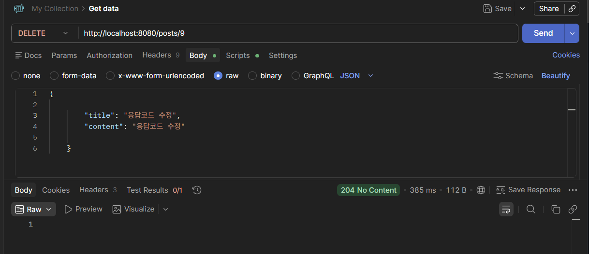
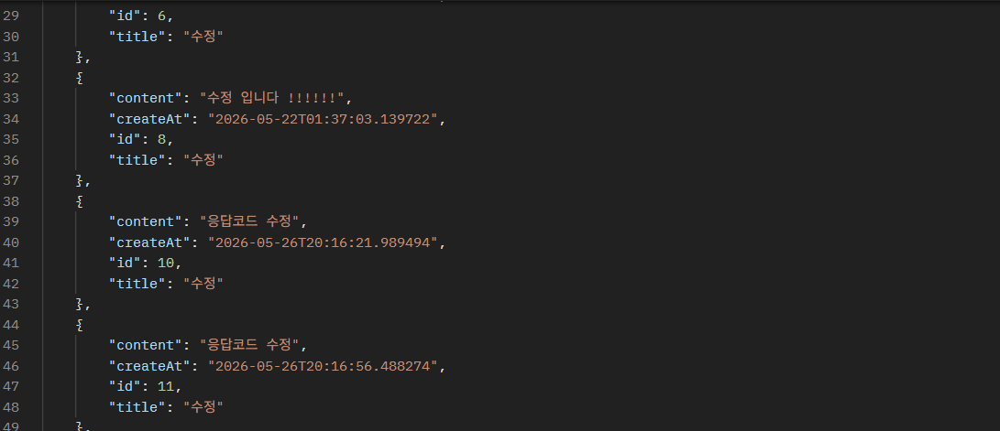
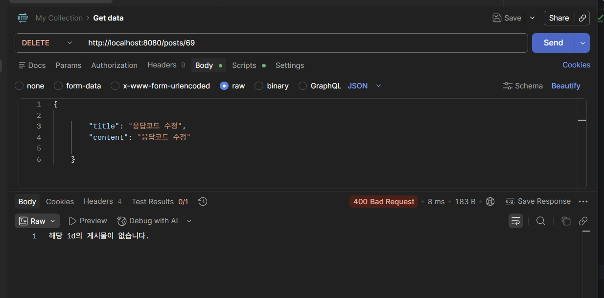

# 과제명
REST API 서버 구현

## ⚙️ 실행 방법

PostApllication 실행 

## 💡 작업 내용
- DB는 H2 사용했습니다.
-게시글 생성 (/post,POST)

-전체 조회(/post,GET)

-단건 조회(/posts/{id},GET)

- 단건 조회 예외(id 없음)

-수정(/posts/{id} ,PUT)

-삭제(/posts/{id} ,DELETE)

## 📡 API 명세 (Spring 과제의 경우)
| Method | URL | 설명 |
| :--- | :--- | :--- |
| POST | /posts | 게시글 생성 |
| GET | /posts | 전체 조회 |
| GET | /posts/{id} | 단건 조회 |
| PUT | /posts/{id} | 수정 |
| DELETE | /posts/{id} | 삭제 |

## 🤔 느낀 점 / 어려웠던 점
- 전체적인 흐름에 집중 하였습니다. 어노테이션을 사용하며 편한점도 있엇지만 기능 들이 많아
자주 사용해보면서 익숙해져야 할 거 같습니다. 
- @Transactional 어노테이션에 대해 정확히 모르겠습니다.. 
- PostService에서 PostResponse.builder()
  .id(post.getId())
  .title(post.getTitle())
  .content(post.getContent())
  .createAt(post.getCreateAt())
  .build(); 이부분이 중복되서 사용되는데 PostResponse(dto 폴더 안)에서 정의해서 가져다 사용하는것이 더 유용한지 궁금합니다.
- 어노테이션을 클래스 상단에 넣는가 생성자 위에 넣는가 함수 위에 넣는가에 대한 위치 중요성도 느끼게 되었습니다 
- Swagger 사용방법에 대해 배워보겠습니다!